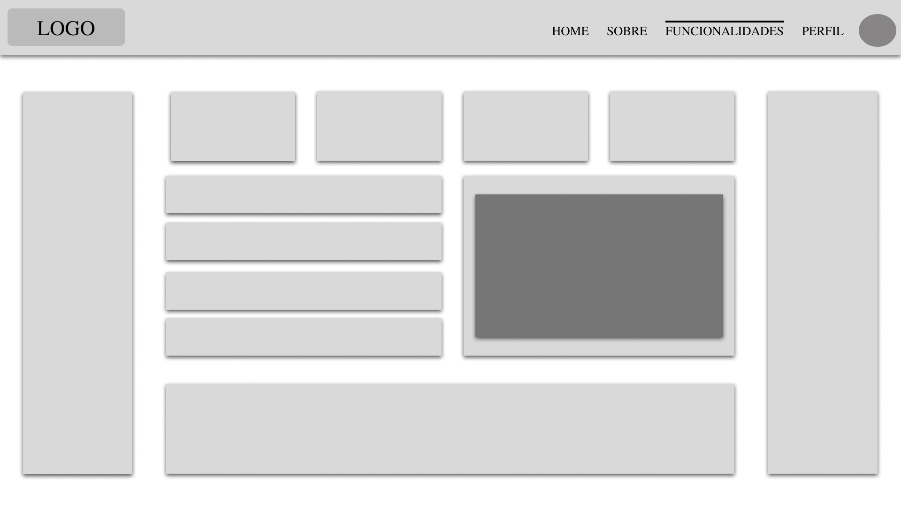

 ##  Interação do Usuário

 O objetivo principal da interação do usuário com a plataforma é proporcionar uma experiência clara e eficiente para o monitoramento e análise do consumo energético de dispositivos domésticos. A interface está sendo projetada com o propósito de facilitar o acesso às informações essenciais de consumo de energia, permitindo que os usuários compreendam seu uso energético de maneira prática e acessível.

 A plataforma permite que o usuário veja informações em tempo real, gere relatórios e receba sugestões para economizar energia. O design foi pensado para tornar a navegação fácil e direta, garantindo que todas as funcionalidades sejam acessíveis sem confundir o usuário com excesso de informações.

 A proposta busca tornar o uso da plataforma agradável e acessível para diferentes tipos de usuários, incluindo aqueles que não têm muita experiência com tecnologia.

 ## Wireframes

 Os wireframes desenvolvidos para a plataforma de controle de consumo de energia foram projetados para oferecer uma experiência intuitiva e acessível. As principais telas incluem a página inicial, que apresenta um resumo do projeto e incentiva o cadastro, e o dashboard do usuário, onde gráficos interativos exibem o consumo energético detalhado. Há também uma ferramenta para análise de contas de energia, permitindo que os usuários insiram dados e recebam relatórios personalizados.

Outras funcionalidades incluem um simulador de consumo baseado nos hábitos do usuário, um painel voltado para empresas que necessitam de um monitoramento mais detalhado, e uma área educativa com informações sobre eficiência energética. Além disso, a plataforma contará com notificações e alertas para ajudar os usuários a adotarem práticas mais sustentáveis. O foco dos wireframes é garantir navegação fluida, acessibilidade e eficiência na apresentação das informações.

## Logo

A logo GreenVolt foi inspirada nos adesivos de eficiência energética encontrados em eletrodomésticos, utilizando barras coloridas que representam diferentes níveis de consumo. O gradiente de cores, indo do vermelho ao verde, simboliza a transição do alto consumo para a eficiência energética, reforçando o propósito da plataforma de ajudar usuários a monitorar e otimizar o uso de energia.

O design limpo e moderno transmite sustentabilidade, tecnologia e inovação, enquanto a tipografia combina tons de verde e preto, destacando a ideia de energia renovável e confiabilidade. O uso da letra "G" estilizada na primeira versão reforça a identidade da marca e cria um elemento visual marcante.

### Diagrama de fluxo

O diagrama apresenta o estudo do fluxo de interação do usuário com o sistema interativo, muitas vezes sem a necessidade de desenhar o design das telas da interface. Isso permite que o design das interações seja bem planejado e tenha impacto na qualidade do design do wireframe interativo que será desenvolvido logo em seguida.

O diagrama de fluxo pode ser desenvolvido com “boxes” que possuem, internamente, a indicação dos principais elementos de interface — tais como menus e acessos — e funcionalidades, como editar, pesquisar, filtrar e configurar, além da conexão entre esses boxes a partir do processo de interação.

