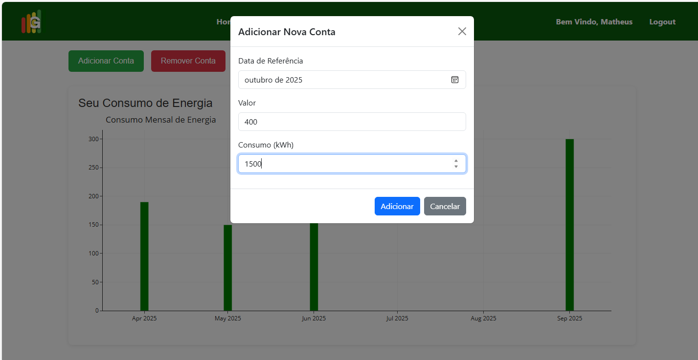

# Registro de testes de software

| **Caso de teste** 	| **CT-001 – Cadastrar Consumo de Energia** 	|
|:---:	|:---:	|
| Requisito associado | O sistema deve permitir que usuários cadastrem seu consumo de energia. |
| Registro de evidência |  |

| **Caso de teste** 	| **CT-002 – Gerar Análise Comparativa** 	|
|:---:	|:---:	|
| Requisito associado | RF-00Y - A aplicação deve permitir que um usuário previamente cadastrado faça login. |
| Registro de evidência | [www.teste.com.br/drive/ct-02](http://www.teste.com.br/drive/ct-02) |

| **Caso de teste** 	| **CT-003 – Exibir Notícias Personalizadas** 	|
|:---:	|:---:	|
| Requisito associado | RF-003 - Deve exibir notícias personalizadas para redução do consumo com base nos dados inseridos pelo usuário. |
| Registro de evidência |  |

| **Caso de teste** 	| **CT-004 – Visualizar Gráficos Interativos** 	|
|:---:	|:---:	|
| Requisito associado | RF-004 - O usuário poderá acessar gráficos interativos mostrando a evolução do consumo de energia ao longo do tempo. |
| Registro de evidência |  |

| **Caso de teste** 	| **CT-005 – Estimar Consumo ** 	|
|:---:	|:---:	|
| Requisito associado | RF-006 - O site deve contar com uma funciolidade interativa para estimar o consumo de aparelhos elétricos do usuário. |
| Registro de evidência |  |

## ✅ Avaliação

A realização dos testes de software permitiu verificar o comportamento do sistema **GreenVolt** frente aos requisitos funcionais definidos. Com os cinco casos de teste aplicados, foi possível identificar tanto pontos positivos quanto aspectos que exigem melhorias.

---

### 🔹 Pontos Fortes

- **Cadastro de consumo de energia (CT-001):**  
  Funcionou corretamente, permitindo ao usuário inserir dados de forma intuitiva. A interface foi bem avaliada em termos de clareza e resposta imediata ao salvar os dados.

- **Análise comparativa (CT-002):**  
  O sistema conseguiu gerar comparativos mensais de forma clara e rápida. As informações foram exibidas com boa visualização gráfica, facilitando a interpretação.

- **Gráficos interativos (CT-004):**  
  Os testes comprovaram a eficiência visual e a interatividade dos gráficos com tooltip, filtro por período e zoom.

- **Estimativa de consumo (CT-005):**  
  O sistema calculou o consumo com base nos dados dos aparelhos informados, retornando resultados precisos e coerentes.

---

### 🔸 Pontos Fracos e Falhas Detectadas

- Pequenos erros visuais em **dispositivos móveis**, especialmente em CT-004, onde os gráficos apresentaram cortes nas legendas em telas menores.

- **Na funcionalidade de notícias (CT-003):**
  - Alguns usuários relataram travamentos na rolagem em determinados navegadores, possivelmente por causa do carregamento dinâmico.
  - O conteúdo exibido **não leva em conta o histórico do usuário**, como consumo registrado ou tipo de dispositivos cadastrados. Esse recurso poderia ser adicionado para tornar a recomendação de notícias mais personalizada e útil.

- **Validação insuficiente** na estimativa de consumo (CT-005):  
  Quando o usuário deixava campos em branco, o sistema retornava `NaN`, o que pode comprometer a experiência e a confiabilidade da aplicação.

---

### 🛠️ Melhorias Planejadas

- Aplicar **responsividade completa** para a área de gráficos, utilizando bibliotecas como `Chart.js` ou `Recharts`, com melhor adaptação para mobile.
- Implementar **validações mais rigorosas** no formulário de estimativa de consumo, evitando erros de execução.
- Otimizar o **carregamento dinâmico de notícias**, aplicando técnicas de lazy loading mais eficientes.
- **Integrar o histórico de consumo e os dispositivos cadastrados** na exibição de notícias, tornando o conteúdo mais personalizado e relevante.
- Aplicar **testes automatizados** com ferramentas como `Jest` ou `Cypress`, para garantir a estabilidade e a evolução segura do sistema.

---

